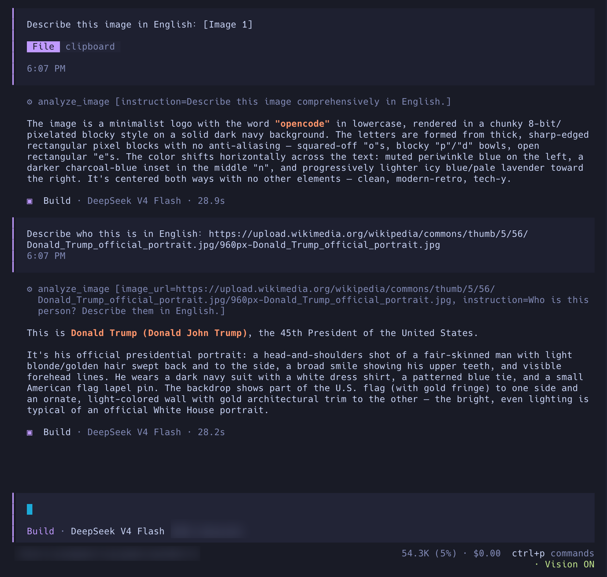

<div align="center">
  <picture>
    <source media="(prefers-color-scheme: dark)" srcset="./assets/banner-dark.png">
    <source media="(prefers-color-scheme: light)" srcset="./assets/banner.png">
    
  </picture>

  <h1>opencode-analyze-image</h1>

  <p>给纯文本模型装上一枚赛博义眼，让它看得见图片。</p>

  <p>
    <a href="https://www.npmjs.com/package/opencode-analyze-image"></a>
    <a href="https://www.npmjs.com/package/opencode-analyze-image"></a>
    <a href="https://github.com/cipherTing/opencode-analyze-image/releases"></a>
    <a href="https://github.com/cipherTing/opencode-analyze-image/blob/main/LICENSE"></a>
    <a href="https://github.com/cipherTing/opencode-analyze-image/issues"></a>
  </p>

  <p>
    <a href="../README.md">English</a>
    ·
    <a href="https://github.com/cipherTing/opencode-analyze-image/issues">反馈问题</a>
  </p>
</div>

> “这是因为视觉比其他一切感官更能使我们认识事物，并揭示事物之间的许多差异。”
>
> ——亚里士多德，《形而上学》第一卷第一章，<a href="https://classics.mit.edu/Aristotle/metaphysics.1.i.html">原文</a>

这是一个独立的社区插件，并非 OpenCode 团队制作，也不隶属于 OpenCode 官方。

## 实际运行效果

<p align="center">
  
</p>

<p align="center"><sub>图片分析在 OpenCode 终端会话中运行。</sub></p>

## 安装

### 预构建 JavaScript 文件

从对应版本的 GitHub Release 下载 `analyze_image.js`：

```bash
mkdir -p ~/.config/opencode/plugins
curl -fL https://github.com/cipherTing/opencode-analyze-image/releases/download/v0.1.2/analyze_image.js \
  -o ~/.config/opencode/plugins/analyze_image.js
```

OpenCode 启动时会自动加载 `~/.config/opencode/plugins/` 中的 JavaScript 和 TypeScript 插件文件。项目级本地插件使用 `.opencode/plugins/` 目录。

如果设置了 `OPENCODE_CONFIG_DIR`，请用该目录替代 `~/.config/opencode`。

完成安装后，重启 OpenCode，然后正常使用即可。

### 可选：终端状态提示

终端状态提示是独立的可选 TUI 功能。图片分析工具不依赖它。需要在终端输入框下方显示 `· Vision ON` 时，单独配置 TUI 入口。

使用预构建 JavaScript 文件时，下载 TUI 文件，并将其路径加入 `~/.config/opencode/tui.json`：

```bash
mkdir -p ~/.config/opencode/tui
curl -fL https://github.com/cipherTing/opencode-analyze-image/releases/download/v0.1.2/analyze_image_tui.js \
  -o ~/.config/opencode/tui/analyze_image_tui.js
```

```json
{
  "plugin": [
    "./tui/analyze_image_tui.js"
  ]
}
```

## 配置

配置文件：

```text
~/.config/opencode/analyze_image/config.json
```

如果设置了 `OPENCODE_CONFIG_DIR`，则使用 `$OPENCODE_CONFIG_DIR/analyze_image/config.json`。

### 最小配置

```json
{
  "trigger_models": [
    "deepseek/deepseek-v4-flash"
  ],
  "api_format": "openai_chat",
  "base_url": "https://api.openai.com/v1",
  "model": "your-vision-model",
  "api_key": "your-api-key",
  "reasoning": {
    "effort": "medium",
    "adaptive": true
  }
}
```

### 必填字段

| 字段 | 说明 |
| --- | --- |
| `trigger_models` | 允许使用插件的主模型列表，填写完整的 `provider/model`。 |
| `api_format` | 接口格式，可选 `openai_chat`、`openai_responses`、`anthropic_messages`。 |
| `base_url` | 辅助视觉模型接口地址。 |
| `model` | 辅助视觉模型 ID。 |
| `api_key` | 视觉模型 API Key，也可以使用 `{env:NAME}` 或 `{file:PATH}` 引用。 |

### 可选字段

| 字段 | 默认值 | 说明 |
| --- | ---: | --- |
| `reasoning.effort` | `medium` | 可选 `none`、`low`、`medium`、`high`、`xhigh`、`max`。 |
| `reasoning.adaptive` | `true` | 仅用于 Anthropic Messages：`true` 使用 adaptive thinking，`false` 使用基于预算的 thinking。 |
| `timeout_seconds` | `120` | 请求超时时间。 |
| `max_retries` | `2` | 请求重试次数。 |
| `max_output_tokens` | `4096` | 最大可见输出长度。 |

### API Key

API Key 可以直接填写，也可以从环境变量或文件中读取：

```json
"api_key": "your-api-key"
```

```json
"api_key": "{env:ANALYZE_IMAGE_API_KEY}"
```

```json
"api_key": "{file:~/.secrets/analyze-image-key}"
```

相对文件路径会按 `config.json` 所在目录解析。

`trigger_models` 使用精确匹配。模型 ID 自身包含斜杠时，保留完整名称即可。

图片大小和目录限制可以直接沿用 [config.example.json](../config.example.json) 中的默认值，只有需要调整时再修改 `image` 节点。

## 完整配置

完整字段清单见 [config.example.json](../config.example.json)。

## 许可证

MIT
